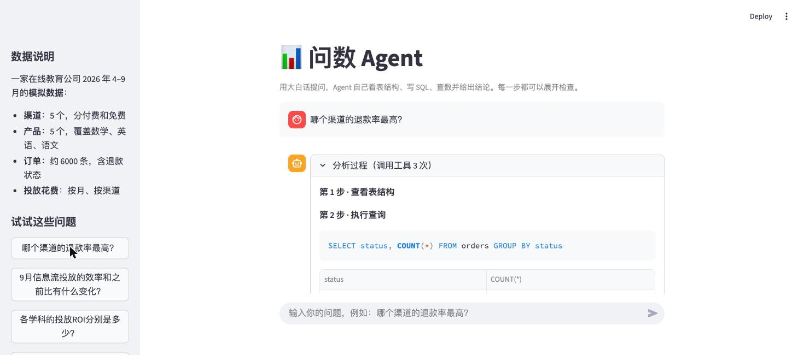

# 问数 Agent

用大白话提问，Agent 自己查看表结构、写 SQL、查数并给出结论。分析过程的每一步（SQL 和查询结果）都可以展开检查。



这是一个学习项目：不依赖任何 Agent 框架，用约 200 行 Python 从零实现 Agent 的核心循环，并在此基础上搭建评测体系。

## 它是怎么工作的

Agent 的本体是一个循环：

1. 把用户的问题和可用工具的说明一起发给大模型
2. 模型要么给出最终答案，要么要求调用某个工具
3. 程序执行工具，把结果发回给模型
4. 回到第 2 步，直到模型给出答案

模型有两个工具可用：

| 工具 | 作用 |
|---|---|
| `get_schema` | 查看所有表的结构和样例数据 |
| `run_sql` | 执行一条只读 SQL 并返回结果 |

## 本地运行

需要 Python 3.9 以上和一个 [DeepSeek API Key](https://platform.deepseek.com)。

```bash
python3 -m venv .venv
.venv/bin/pip install -r requirements.txt
echo "DEEPSEEK_API_KEY=你的Key" > .env

.venv/bin/python create_db.py        # 生成模拟数据库
.venv/bin/streamlit run app.py       # 启动网页界面
```

也可以不用界面，直接在命令行提问：

```bash
.venv/bin/python agent.py "哪个渠道的退款率最高？"
```

## 数据

`create_db.py` 生成一家在线教育公司 2026 年 4–9 月的模拟数据，全部为编造：

| 表 | 内容 |
|---|---|
| `channels` | 5 个获客渠道，分付费和免费 |
| `products` | 5 个产品，覆盖数学、英语、语文 |
| `orders` | 约 6000 条订单，含退款状态和退款日期 |
| `ad_spend` | 3 个付费渠道每月的投放花费 |

数据里埋了几个已知答案（例如某渠道退款率异常高、投放花费无法拆到学科），用于评测 Agent 答得对不对。

## 几个设计取舍

- **数据库只读**：以只读模式打开，且只放行 `SELECT`，模型写出修改语句也改不了数据。
- **限制循环轮数**：最多 10 轮，防止模型陷入死循环持续消耗 token。
- **限制返回行数**：单次查询最多返回 50 行，避免把大量明细塞进上下文。
- **SQL 报错原样返回给模型**：让它自己读错误信息并修正，而不是直接失败。

## 文件说明

| 文件 | 作用 |
|---|---|
| `agent.py` | Agent 本体：提示词、工具、循环 |
| `app.py` | Streamlit 网页界面 |
| `create_db.py` | 生成模拟数据库 |
| `eval_set.json` | 评测集：问题、类型、标准答案 |
| `run_eval.py` | 批量运行评测集并记录步数、token、耗时 |

## 已知问题

手工检查最初 3 道测试题时发现：

- SQL 查出的数字都正确，错误集中在模型把数字转述成文字的环节（例如把环比写成同比、把涨五成说成翻倍）。
- 同一个指标在不同问题里口径不一致（退款率有时按订单数算，有时按金额算）。
- 部分汇总数字由模型心算得出，没有走 SQL。
- 回答内容常超出问题范围，成本随之上升。

## 后续计划

- [ ] 扩充评测集，覆盖简单、多步、模糊、算不了四类问题
- [ ] 制定评分标准，用大模型做裁判自动打分，并人工抽检一致率
- [ ] 针对上述问题迭代提示词，对比改进前后的评测结果
